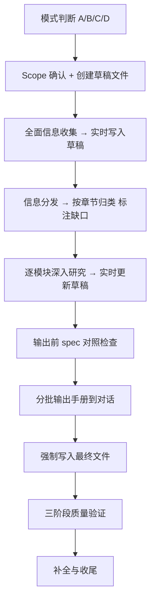

[English](README.md) | [中文](README.zh-CN.md)

# Global HR Compliance Playbook

[]()
[](LICENSE)
[](https://docs.claude.com/en/docs/claude-code)
[](README.md)

> 全球人力合规与运营专家 — 一个面向海外人力合规与运营场景的 Skill，用于生成国家/地区用工合规手册、查询劳动法规细节，并支持跨境用工实务分析与既有手册增量更新。

这个 Skill 以海外人力同事在跨国人力管理中的长期实践经验，以及过往编制中国、日本、新加坡、阿联酋等国家和地区人力合规用工手册所沉淀的方法论为基础，将其中关于框架设计、研究逻辑、信息校验、内容组织、语言风格、排版规范和实操提示等关键能力，系统蒸馏为一套可复刻、可迭代的 AI Skill。

它覆盖招聘、薪酬税务、社保、劳动合同、签证/工作许可、员工关系、数据合规等员工全生命周期议题，重点服务企业海外用工合规研究、制度建设和 HR 实操落地。通过来源优先级控制、关键信息交叉验证、规则层级区分、Spec 对照检查及多层质量复核机制，Skill 能够提升法规检索与内容输出的准确性、权威性和可追溯性，降低 AI 幻觉及信息误用风险，帮助企业将分散的法规信息转化为可执行、可审计、可复用的管理指引。

## 它能做什么

Skill 根据请求复杂度自动分流，支持以下四种工作模式：

- **完整手册生成（模式 A）**：针对"为某国家或地区编制完整用工合规手册"的需求，按 14 章标准结构系统性产出 Markdown 手册；基于实测，从零完成一份完整手册的端到端耗时约 40–60 分钟以上；如提供已有原始资料（法律文件、政府指南、律所报告等），可相应缩短；
- **法规快查（模式 B）**：针对单点事实问题——最低工资、加班费率、试用期、社保比例、解雇赔偿等——定向检索官方来源后给出简明答复，附原文链接与生效日期；
- **实务咨询（模式 C）**：针对场景化操作问题——如何在德国合规解雇、如何派驻员工至新加坡、如何在法国实施大规模裁员等——输出"合规步骤 + 风险点 + 所需文件"的可执行方案；
- **增量更新（模式 D）**：针对法规变更或局部修订需求，对已有手册执行章节级 diff 式更新，无需重新生成整本。

输出全程围绕"企业如何做、何时做、由谁做、有哪些风险"展开，覆盖招聘准入、工作许可、签证/居留、薪酬个税、社保公积金、劳动合同、解雇与裁员、假期休假、工会与员工手册、数据合规、劳动争议、外汇与跨境支付等议题；并明确区分 **法律强制 / 官方执法实践 / 市场惯例 / 企业自主 / 待专业复核** 五类规则层级，对外籍员工与本地员工的差异适用规则单独说明。

## 适用场景

适用于以下需求：

- 生成/编写某国家或地区的完整用工合规手册；
- 查询特定国家的劳动法细节（最低工资、加班费、试用期、解雇赔偿、社保比例等单点事实问题）；
- 解答场景化的海外 HR 实务问题（如何在德国合规解雇、如何派驻员工、如何在法国进行大规模裁员）；
- 对已有合规手册进行审查、补充或基于法规变更的增量更新。

适用对象：跨国公司 HR、外派项目经理、全球用工服务商、劳动法咨询从业者。

## 工作模式（Mode Dispatch）

Skill 会根据请求自动判断采用哪种模式，**用户无需手动指定**：

| 模式 | 触发场景 | 流程深度 | 输出 |
|:----|:--------|:--------|:-----|
| **A. 完整手册生成** | "做一份 [国家] 用工合规手册" | 完整 9 步 workflow | 14 章完整手册 `.md` 文件 |
| **B. 法规快查** | "X 国最低工资是多少" | 定向搜索 → 简明答复 | 直接答复 + 来源链接，不落盘 |
| **C. 实务咨询** | "如何在德国合规解雇某人" | 简化版多步流程 | "步骤 + 风险 + 文件"答复，不落盘 |
| **D. 增量更新** | "更新韩国手册的最低工资部分" | diff 流程 | 修改相关章节 |

> 模式 B/C 不强制创建文件，但**仍遵守来源标注、不确定性提示、专业复核提示**等核心约束。

## 安装

### 前置条件

- 已安装 [Claude Code](https://docs.claude.com/en/docs/claude-code) 或其他兼容 Agent Skills 的 AI 助手。
- 如采用 clone 方式安装，需要已安装 Git。
- 支持系统：Windows、macOS、Linux。

### 方式一：Clone 到 skills 目录

```bash
# Linux / macOS
git clone https://github.com/AlexDou-Y/global-hr-compliance-playbook.git \
  ~/.claude/skills/global-hr-compliance-playbook
```

```powershell
# Windows PowerShell
git clone https://github.com/AlexDou-Y/global-hr-compliance-playbook.git `
  "$HOME\.claude\skills\global-hr-compliance-playbook"
```

### 方式二：手动下载

1. 下载本仓库 ZIP 文件并解压。
2. 将整个 `global-hr-compliance-playbook/` 目录复制到对应 skills 目录：

| AI 助手 | Linux / macOS | Windows |
|:---|:---|:---|
| Claude Code | `~/.claude/skills/` | `%USERPROFILE%\.claude\skills\` |

### 验证安装

重启或刷新 Claude Code 后，输入 `/skills`，确认列表中能看到 `global-hr-compliance-playbook`。

## 使用方式

直接用自然语言描述需求，Skill 会自动识别模式：

```text
使用 global-hr-compliance-playbook，帮我生成一份新加坡的用工合规手册。
要求覆盖外籍员工与本地员工的差异，所有数字（最低工资、社保比例、加班费率）需要标注官方来源；
如无法找到官方来源，请使用降级提示并列入"需人工核实"项。
```

为提高输出质量，建议同时提供：

- 国家/地区，及是否涉及特殊司法管辖区（如阿联酋 DIFC、美国加州）；
- 员工类型（本地员工、外籍员工、派驻员工）；
- 法定雇主与发薪主体；
- 已有的内部政策、EOR 协议或当地律师反馈（如有）；
- 重点关注的议题（如解雇流程、外籍工签、数据跨境）。

### 提供已有材料（可选）

如果你已有原始资料（法律文件、政府指南、律所报告等），可以一并提供给 Skill：

```text
基于以下材料生成韩国用工合规手册：
[粘贴文件内容或提供文件路径]
```

Skill 会先读取已有资料，再针对缺口补充检索，避免重复劳动，端到端耗时也会相应缩短。

### 受众画像（可选）

不同受众需要不同的内容深度。在请求时显式指明受众，可针对性调整侧重：

| 受众类型 | 内容侧重 | 深度 |
|:---------|:---------|:-----|
| 总部法务 / 合规 | 法律条款、风险分析、处罚后果 | 高 |
| 本地 HR 实操 | 操作流程、时限、检查清单、计算示例 | 极高 |
| 外派员工 | 个人权益、税收优惠、签证流程 | 中 |
| 管理层决策 | 成本概览、风险等级、合规要点 | 低 |

```text
帮我生成韩国用工合规手册，面向本地 HR 实操使用。
```

## 服务立场

这个 Skill 服务于企业内部管理决策与制度落地。

它重点关注：

- 企业的合规暴露与法定义务；
- 当地强制性劳动规则、法定最低权益、官方执法口径；
- 薪酬、个税、社保、签证/工作许可的成本与流程影响；
- 外籍员工与本地员工适用规则的差异；
- 高风险、有处罚后果或存在分歧的事项。

它**不提供最终法律意见**。所有高风险、争议或个案判断事项会被显式标注为"需本地律师/税务/移民顾问复核"，并在不确定时使用降级提示而非伪造确定答案。

## 工作流



1. **模式判断**  
   按请求特征分流到 A/B/C/D，避免对简单问题启动重型流程。

2. **Scope 确认 + 创建草稿文件**  
   确认适用法域、章节范围；立即在 skill 同目录下创建 `[国家]_draft.md`，作为研究过程的唯一持久化载体。

3. **全面信息收集 → 实时写入草稿**  
   广撒网检索官方法规与权威解读；每完成一个主题立即用 Edit 工具写入草稿，不积累在对话 context 中。

4. **信息分发**  
   把草稿内容按 14 章归类，标注每章的信息缺口。

5. **逐模块深入研究**  
   读取对应 spec 文件（按需，不预加载），对照要求识别缺失，定向补充检索后写入草稿，每完成一章标记 ✅。

6. **输出前 spec 对照检查**（⚠️ 强制，不得跳过）  
   逐章对照 spec 检查格式、表格、必答问题、计算示例、风险提示，缺失项补齐再进入正式输出。

7. **分批输出手册**  
   按 spec 格式整理，每批 2-3 章输出到对话。

8. **强制写入最终文件**  
   用 Edit 工具分批追加写入 `[国家]用工合规手册_YYYYMMDD_Vx.x.md`，保存到 skill 同目录（相对路径），写完读取末尾验证完整性。

9. **三阶段质量验证**  
   结构 pass（编号、标题、章节齐全）→ 内容 pass（缺口、表格、链接）→ 实务 pass（数字、步骤、可执行性），每个 pass 独立运行。

### 模式 D 子流程（增量更新）

针对单点法规变更或局部修订需求，模式 D 不走完整 9 步：

1. 读取现有手册文件，定位被影响章节；
2. 识别关联章节（如最低工资变化关联到薪酬、招聘、合同、风险等）；
3. 检索最新法规与官方解读；

4. 输出 diff 格式变更（旧 → 新 + 变更说明 + 来源）；
5. 应用到手册文件，更新版本号与生效日期。

## 手册结构

生成的完整手册采用统一 14 章结构：

```text
第1章  序言（适用范围、版本说明）
第2章  国家/地区概况
第3章  招聘
第4章  薪酬
第5章  个人所得税
第6章  社会保险与公积金
第7章  劳动合同（含合同解除与赔偿）
第8章  假期
第9章  工会与员工手册
第10章 数据合规
第11章 劳动争议
第12章 外汇与跨境支付
第13章 风险提醒
第14章 资料汇总（链接、模板、工具包）
```

每个条款按 **规则 → 实务 → 风险** 三层展开：

- **规则层**：法律条文原文、法定门槛、官方执法口径，附官方来源链接；
- **实务层**：企业如何执行、所需文件、责任主体、操作步骤；
- **风险层**：常见踩坑、违规后果、风险预防建议。

每段内容应至少包含以下之一：具体数字（金额、比例、天数、期限）、具体操作步骤、具体法律条款引用、具体风险场景。

### 章节规模指引

各章目标体量差异较大，与该国家/地区在该议题上的复杂度相关：

| 章节 | 目标行数 | 说明 |
|:-----|:--------:|:-----|
| 序言 | 15–25 | 简洁声明 |
| 国家概况 | 50–80 | 2–3 个表格为主 |
| 招聘 | 120–180 | 签证、背调、Offer 是重点 |
| 薪酬 | 150–250 | 加班费计算、工资支付是核心 |
| 劳动合同（含解除） | 200–350 | 最高风险模块，需操作级细节 |
| 其他章节 | 30–200 | 根据议题复杂度调整 |

### 输出格式

手册采用飞书兼容的 Markdown 格式，包含：

- **6 个固定图例**：📢 法律更新预警 ｜ ⚠️ 风险提示 ｜ ❗ 注意事项 ｜ 📋 实务要点 ｜ ✅ 合规做法 ｜ ❌ 违规 / 禁止
- **严格层级编号**：`1` → `1.1` → `1.1.1` → `1.1.1.1`
- **对比表格**：本地 vs 外籍、普通地区 vs 特殊司法管辖区
- **关键法规附官方链接**：可点击跳转至原文。

## 来源纪律

每个事实都必须有来源支撑。

来源优先级：

1. 政府官网、官方法律文本、法律数据库、官方公报；
2. 劳工部、移民局、税务机关、社保机关、监管机构、法院或劳动仲裁机构的官方指南；
3. 政府 FAQ、雇主指南、工资令、假期权益页面、签证/工签页面；
4. 顶级律所、四大会计师事务所、知名咨询公司的权威解读；
5. 专业媒体（如 Lexology）、学术资源、行业报告，仅作为辅助；
6. 模型知识库只能作为最后兜底。

**禁止使用**：无作者百科、纯营销内容、个人博客、AI 生成内容。

如未检索到官方来源，输出必须包含：

```text
⚠️ 未检索到官方来源，以下基于模型知识库，需人工核实。
```

冲突处理：以最新有效规则为准；以官方来源为准；不同官方来源冲突时以直接主管机构口径为准；仍无法确认时标注 `⚠️ 存在口径分歧，建议咨询本地律师`。

## 防幻觉机制

合规手册的错误成本很高（一条错误的解雇赔偿规定可能导致诉讼），因此本 Skill 把反幻觉做成 **硬约束** 而非建议：

| 机制 | 具体做法 |
|:-----|:--------|
| **来源优先级** | 见上节"来源纪律"；明确禁用无作者百科、个人博客、AI 生成内容 |
| **强制标注来源** | 所有提取信息必须附 URL 和获取时间；输出准则第 9 条："严禁凭空捏造" |
| **不确定性显式化** | 来源冲突 → `⚠️ 存在口径分歧`；高风险事项 → 提示需本地律师/税务/移民顾问复核 |
| **降级而非沉默** | 工具不可用时标注"⚠️ 未检索到官方来源，以下基于模型知识库，需人工核实"，不允许偷偷用模型记忆冒充检索 |
| **反"凭记忆输出"** | Skill 明文写道"凭记忆输出是头号失败模式"，强制每章读 spec 后再写 |
| **持久化落盘** | 研究结果实时写入草稿文件，避免 auto-compact 后凭印象续写 |
| **规则层级区分** | 法律强制 / 官方执法实践 / 市场惯例 / 企业自主 / 待专业复核 — 防止把"通常这么做"伪装成法律要求 |

> 注意：这些是流程约束，不是技术拦截。模型仍可能犯错，**正式应用前必须由当地持牌律师复核**（见[免责声明](#免责声明)）。

## 目录结构

```text
global-hr-compliance-playbook/
├── skill.md                    # 主入口（Claude 加载的入口文件）
├── README.md                   # 英文版
├── README.zh-CN.md             # 本文档
├── ARCHITECTURE.md             # 架构说明
├── CHANGELOG.md                # 版本变更日志
├── LICENSE                     # MIT 许可证
├── 1_core/                     # 角色定位、能力、输出准则
├── 2_tools/                    # 工具配置（Web Search 策略）
├── 3_workflow/                 # 工作流（研究流程、质量校验、增量更新等 13 个子流程）
├── 4_output/                   # 输出规范（格式模板、术语标准、章节尺度）
├── 5_spec/                     # 章节规格（14 章详细要求 + 必答问题表 + 命名规范）
└── 6_meta/                     # 元信息
```

## 适用国家/地区

理论上支持任意国家/地区，已实测验证：

- **东亚**：日本、韩国、中国香港；
- **东南亚**：新加坡、马来西亚、印尼、越南、泰国；
- **中东**：阿联酋（含 DIFC）、沙特阿拉伯；
- **欧美**：美国（联邦及加州）、英国、德国、法国。

> 注：法规更新较快的地区（如欧盟），建议生成手册后人工复核最新立法动态。

## 示例 Prompt

**模式 A — 完整手册生成**：

```text
使用 global-hr-compliance-playbook，帮我生成一份新加坡的用工合规手册。
重点覆盖外籍员工的工作准证（EP / S Pass / WP）差异和申请流程。
所有最低工资、CPF 比例、税率请标注 MOM/IRAS/CPF Board 官方来源。
```

**模式 B — 法规快查**：

```text
韩国 2026 年最低工资标准是多少？请标注官方来源和生效日期。
```

**模式 C — 实务咨询**：

```text
我们要在德国解雇一名工作 8 年的员工（非过失性解雇），
请说明合规步骤、需要的文件、可能的风险，以及补偿金的计算口径。
```

**模式 D — 增量更新**：

```text
基于 2026 年 1 月生效的阿联酋 Federal Decree-Law No. 9 of 2024，
更新现有阿联酋手册的"年假"和"病假"两节，标注变更点。
```

### 模式 B 输出样例

针对"韩国试用期最长是多久？"这类单点查询，Skill 输出形式如下：

```text
韩国试用期规定：

📋 核心规定
- 最长期限：3 个月（劳动基准法第 34 条）
- 特殊情况：2 年以下定期合同，试用期不得超过合同期的 1/2
- 试用期内解雇：需要正当理由，但举证标准相对宽松

⚠️ 风险提示
- 试用期满后自动转正，无需额外手续
- 试用期内解雇仍需提前 30 天通知或支付代通知金
- 试用期工资不得低于正式工资的 90%

法律依据：劳动基准法第 34 条、第 26 条
```

> 上述为格式示意，**实际数字以最新检索到的官方来源为准**。

## 常见问题

### Q1：生成的手册保存在哪里？

默认保存在 skill 同目录下（相对路径，便于 skill 重命名/迁移）：
`<skill 目录>/[国家名称]用工合规手册_YYYYMMDD_Vx.x.md`

### Q2：如何更新已有手册？

使用模式 D 增量更新：

```text
更新韩国手册的最低工资部分到 2026 最新数据
```

Skill 会自动识别关联章节并输出 diff，避免重新生成整本。

### Q3：生成一份完整手册需要多久？

取决于国家复杂度和已有资料：

- **从零研究**：约 40–60 分钟以上（基于实测）；
- **提供已有资料**：相应缩短，具体取决于资料完备程度。

### Q4：支持哪些国家？

理论上支持任意国家/地区。已实测验证：日本、韩国、中国香港、新加坡、马来西亚、印尼、越南、泰国、阿联酋（含 DIFC）、沙特阿拉伯、美国（联邦及加州）、英国、德国、法国。

### Q5：如何确保法律信息的准确性？

通过三层机制（详见上方 [防幻觉机制](#防幻觉机制) 节）：

1. 来源优先级：政府官网与官方法律文本 > 顶级律所/四大解读 > 其他；
2. 多来源交叉验证关键数字；
3. 所有事实强制标注来源；无法检索到官方来源时显式降级标注 ⚠️。

### Q6：手册可以直接交给企业使用吗？

手册提供合规框架与实务指引，但：

- ⚠️ 正式应用前必须由当地持牌律师复核；
- ⚠️ 法律可能变更，需定期更新（手册中标注的有效期）；
- ⚠️ 个案场景需结合企业具体情况单独分析。

详见下方 [免责声明](#免责声明)。

## 路线图

- [x] 英文版 README（International Edition）
- [ ] 多语言手册输出支持（English / 日本語 / 한국어）
- [ ] 集成 Claude Code Plugin Marketplace
- [ ] 章节模板可视化预览

## 致谢

本 Skill 基于 Global HR Alex Dou 在中外企业从事 HR 管理，以及实际编制日本、新加坡、阿联酋等多国手册的经验持续优化。

## 贡献

欢迎提交 Issue 和 Pull Request：

- **报告问题**：法规错误、模板缺陷、流程改进建议；
- **新增国家**：欢迎贡献已实测的国家手册作为参考样本；
- **改进 Prompt**：优化研究阶段的搜索策略、质量校验清单。

提交 PR 前请阅读 [CHANGELOG.md](CHANGELOG.md) 了解版本演进。

## 免责声明

本 Skill 生成的合规手册仅供参考，**不构成法律意见**。各国劳动法规复杂多变，正式应用前请：

1. 由当地持牌律师或专业咨询机构复核；
2. 关注法规更新（手册中标注的有效期）；
3. 结合企业实际情况调整执行细节。

作者及贡献者不对使用本工具产生的任何法律或商业后果承担责任。

## 许可证

[MIT](LICENSE) © 2026

## 相关资源

- [Claude Code 官方文档](https://docs.claude.com/en/docs/claude-code)
- [Anthropic Skills 仓库](https://github.com/anthropics/skills)
- [Skill 编写指南](https://docs.claude.com/en/docs/claude-code/skills)
